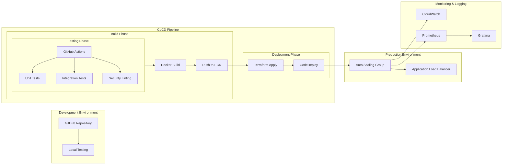

## CI/CD Pipeline

- Development:
    * GitHub repository for version control
    * Local testing environment for developers

- CI/CD Pipeline (GitHub Actions):
    * Testing Phase: Unit tests, integration tests, security scanning
    * Build Phase: Docker image creation and push to ECR
    * Deployment Phase: Infrastructure as Code with Terraform

- Production:
    * Auto Scaling Group for EC2 instances
    * Application Load Balancer for traffic distribution

- Monitoring:
    * CloudWatch for AWS metrics
    * Prometheus/Grafana for custom metrics

