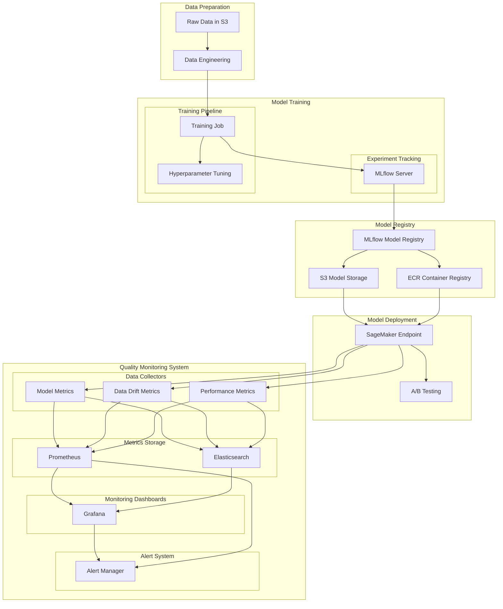

## ML Model Workflow:

- Data Preparation:
    * Raw data stored in S3
    * Data engineering pipeline

- Training:
    * Training jobs
    * Experiment tracking with MLflow
    * Hyperparameter optimization (Optional)

- Model Registry:
    * MLflow Model Registry for versioning
    * S3 for model artifact storage
    * ECR for container images

- Deployment:
    * SageMaker endpoints for inference
    * A/B testing capability
    * Continuous monitoring

- Quality Checks:
    * Data quality monitoring
    * Model quality monitoring
    * Performance analysis

### Monitoring system:

1. Centralized Monitoring with Grafana:
   - Quality Metrics Dashboard:
     * Data drift monitoring
     * Model performance metrics
     * Prediction quality indicators
     * Resource utilization stats
   
   - Time-series Analysis:
     * Historical performance trends
     * Anomaly detection
     * Seasonality analysis

2. Data Collection Pipeline:
   - Model Metrics:
     * Inference latency
     * Prediction confidence scores
     * Model accuracy metrics
   
   - Data Drift Metrics:
     * Feature distribution changes
     * Input data quality scores
     * Data schema validation
   
   - Performance Metrics:
     * Endpoint throughput
     * Error rates
     * Resource utilization

3. Storage Solutions:
   - Prometheus:
     * Real-time metrics
     * Short-term storage
     * Query optimization
   
   - Elasticsearch:
     * Long-term storage
     * Complex query capabilities
     * Log aggregation

4. Alert System:
   - Alert Manager:
     * Threshold-based alerts
     * Anomaly detection
     * Alert routing and grouping
   
   - Integration channels:
     * Email notifications
     * Slack alerts
     * PagerDuty integration

5. Suggested Grafana Dashboards:

   a. Model Performance Dashboard:
   - Accuracy metrics over time
   - Confusion matrix
   - ROC curves
   - Precision-recall curves

   b. Data Quality Dashboard:
   - Feature distributions
   - Missing value rates
   - Data drift indicators
   - Schema validation status

   c. Operational Dashboard:
   - Endpoint health
   - Resource utilization
   - Latency percentiles
   - Error rates
