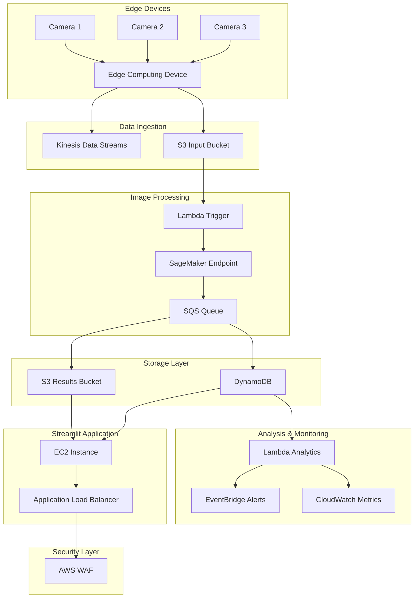

## Cloud Processing

1. Edge Layer:
   - Multiple cameras feeding into edge computing devices
   - Edge devices can perform initial preprocessing and filtering

2. Data Ingestion:
   - Kinesis Data Streams for real-time data ingestion
   - S3 input bucket for batch processing
   - Flexible to handle both real-time and batch workflows

3. Processing Layer:
   - Lambda functions trigger processing of new images
   - Model inference happens via SageMaker endpoint for scalability and management
   - SQS queue to handle processing results

4. Storage Layer:
   - S3 bucket for storing processed results
   - DynamoDB for metadata and classification results

5. Analysis & Monitoring:
   - EventBridge for alerts and automation
   - CloudWatch for monitoring and metrics
   - Lambda functions for custom analytics

6. Visualization:
   - Streamlit app running on EC2
   - Application Load Balancer (ALB) for load distribution
   - AWS WAF for web application security
   - Streamlit app directly accesses DynamoDB and S3 for data visualization

