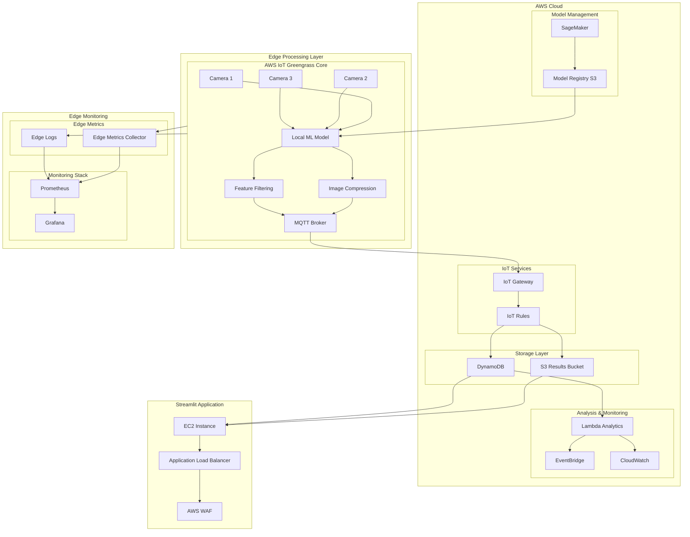
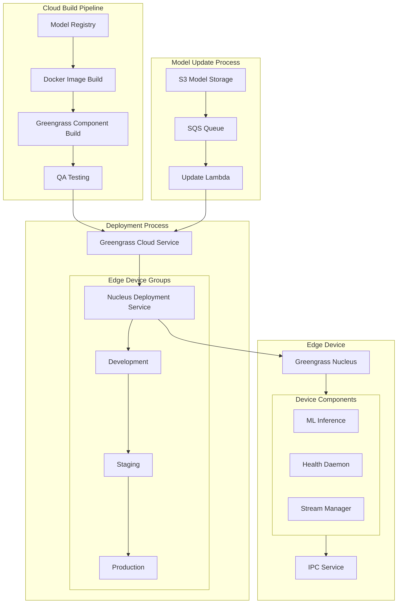
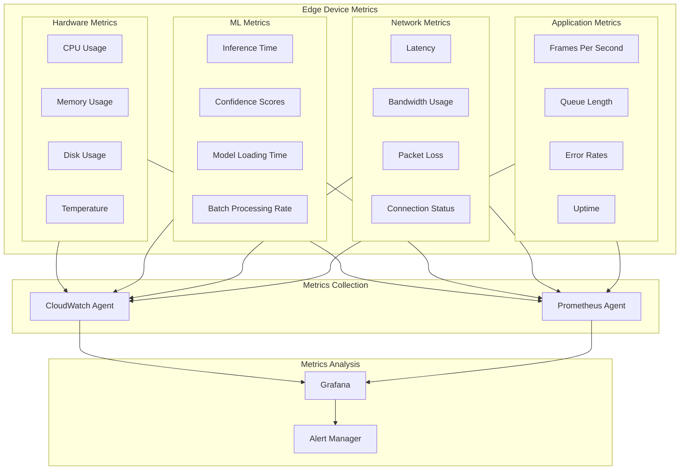

## Edge processing

1. Edge Processing Layer:
   - AWS IoT Greengrass Core running on edge devices
   - Local ML model inference
   - Image compression and filtering
   - Local MQTT broker for messaging
   - Edge metrics collection

2. Edge Processing Features:
   - Real-time inference at the edge
   - Local data filtering to reduce bandwidth
   - Batch synchronization of results
   - Model updates from cloud

3. Edge-to-Cloud Communication:
   - MQTT protocol for messaging
   - IoT Rules for message routing
   - Selective data transmission
   - Secure communication

4. Model Management:
   - Model training in SageMaker
   - Model versioning in S3
   - Automated model updates to edge
   - A/B testing capability

5. Edge Monitoring:
   - Local metrics collection
   - Performance monitoring
   - Resource utilization
   - Model inference metrics

Benefits of Edge Processing:

1. Reduced Latency:
   - Real-time processing at the edge
   - Immediate response capability
   - Lower inference times

2. Bandwidth Optimization:
   - Local filtering of irrelevant data
   - Compressed data transmission
   - Batch processing option

3. Improved Reliability:
   - Offline operation capability
   - Local data storage
   - Resilient to network issues

4. Cost Efficiency:
   - Reduced cloud processing
   - Lower data transfer costs
   - Optimized resource usage

### Edge Deployment Strategy

A. Deployment Pipeline:
- Component Packaging:
  * ML model containerization
  * Greengrass component creation
  * Dependency management
  * Configuration bundling

B. Staged Rollout:
- Development Group:
  * Initial deployment
  * Feature testing
  * Performance validation
- Staging Group:
  * Load testing
  * Integration validation
  * Canary testing
- Production Group:
  * Gradual rollout
  * Monitoring
  * Rollback capability

C. Deployment Configuration:
- Resource Allocation:
  * CPU/GPU requirements
  * Memory limits
  * Storage requirements
- Networking:
  * Port configurations
  * Security groups
  * VPN settings
- Component Dependencies:
  * Version compatibility
  * Inter-component communication
  * System requirements

### Edge Monitoring Metrics:

A. Hardware Metrics:
- CPU Usage:
  * Overall utilization
  * Per-core metrics
  * Temperature
- Memory:
  * Available RAM
  * Swap usage
  * Memory leaks
- Storage:
  * Disk space
  * I/O operations
  * Read/write latency
- GPU (if applicable):
  * Utilization
  * Memory usage
  * Temperature

B. ML Metrics:
- Performance:
  * Inference time
  * Batch processing rate
  * Model loading time
- Quality:
  * Confidence scores
  * Error rates
  * Accuracy metrics
- Resource Usage:
  * Memory footprint
  * CPU/GPU utilization
  * Cache hit rates

C. Application Metrics:
- Processing:
  * Frames per second
  * Queue length
  * Processing latency
- Reliability:
  * Error rates
  * Crash reports
  * Component health
- System:
  * Uptime
  * Component status
  * Version information

### Model Update Process:

A. Update Triggering:
- Automated triggers:
  * Performance degradation
  * New model version
  * Scheduled updates
- Manual triggers:
  * Emergency fixes
  * A/B testing
  * Feature updates

B. Update Flow:
1. Model Preparation:
   - Version tagging
   - Validation testing
   - Compression/optimization

2. Distribution:
   - S3 upload
   - Manifest generation
   - Component updates

3. Deployment:
   - Progressive rollout
   - Health checking
   - Fallback preparation

4. Validation:
   - Performance verification
   - Error monitoring
   - Rollback triggers

C. Rollback Strategy:
- Automatic rollback triggers:
  * Performance degradation
  * Error rate increase
  * Resource exhaustion
- Manual intervention points
- Version history maintenance
